# 📊 Tableau de Bord Interactif pour l’Enseignement de l’Analyse Numérique

Un projet éducatif interactif conçu pour enseigner et visualiser les méthodes d’analyse numérique de manière intuitive.  
Le tableau de bord permet aux étudiants d’explorer des algorithmes comme **Gauss, Jacobi, Newton** à travers des **quiz**, des **puzzles interactifs**, et des **visualisations pas-à-pas**.

---

## 🔑 Page de Connexion

L’accès au tableau de bord se fait via une interface de connexion simple et ergonomique :  

Fonctionnalités :  
- Authentification par **nom d’utilisateur et mot de passe**  
- Affichage des **erreurs de connexion**  
- Message d’astuce pédagogique : *« Essayez la méthode de Newton pour une convergence rapide »*  
- Illustration mathématique intégrée (formule de Newton-Raphson)  

---

## 🚀 Fonctionnalités Principales

- ✅ **Quiz interactifs** pour tester la compréhension  
- ✅ **Visualisations étape par étape** des méthodes numériques  
- ✅ **Puzzle éducatif** pour résoudre des systèmes linéaires  
- ✅ **Corrections intelligentes** avec feedback personnalisé  
- ✅ **Animations et vidéos** pour un apprentissage immersif  

---

## 🖼️ Aperçus du Tableau de Bord

### 🎯 Quiz & Résultats
- Interface du quiz et exemples de questions :  
  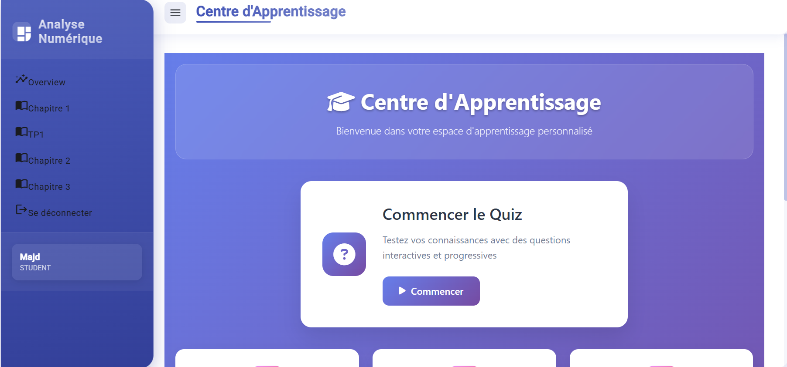  
  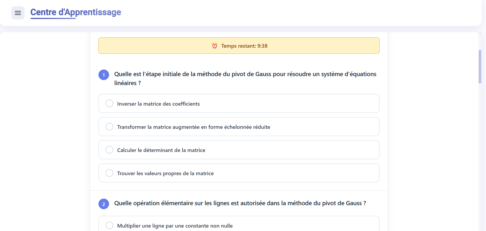  
  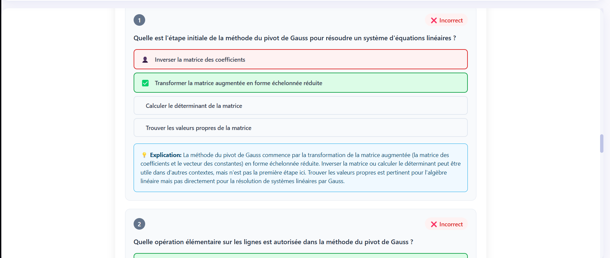  

- Résultats et feedback :  
  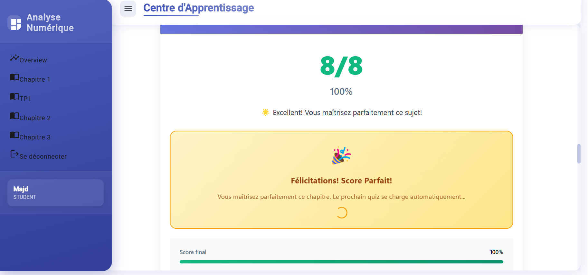  
  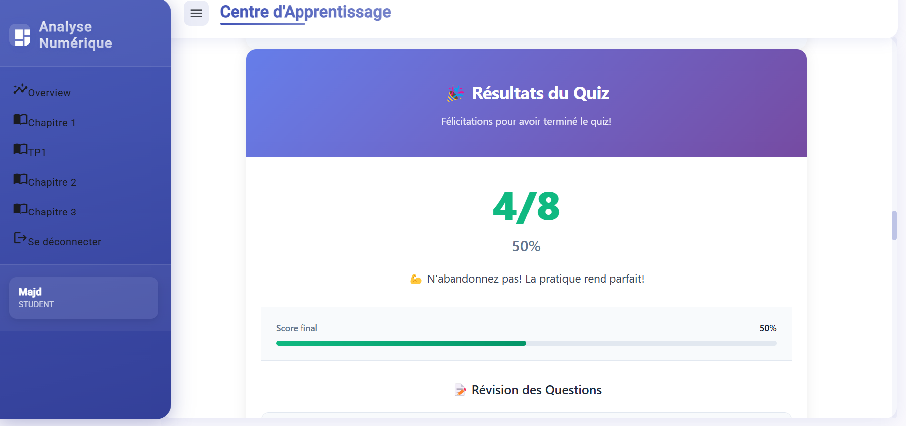  
  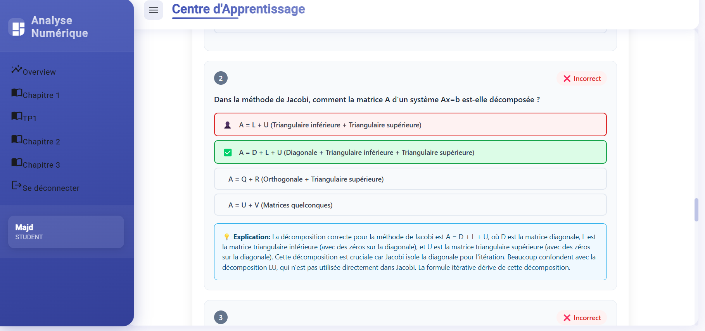  

---

### 🧩 Puzzle & Exercices
- Puzzle de Gauss :  
  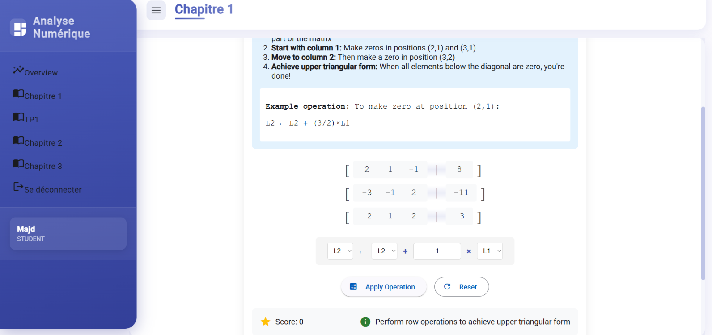  

- Affichage dynamique du quiz :  
  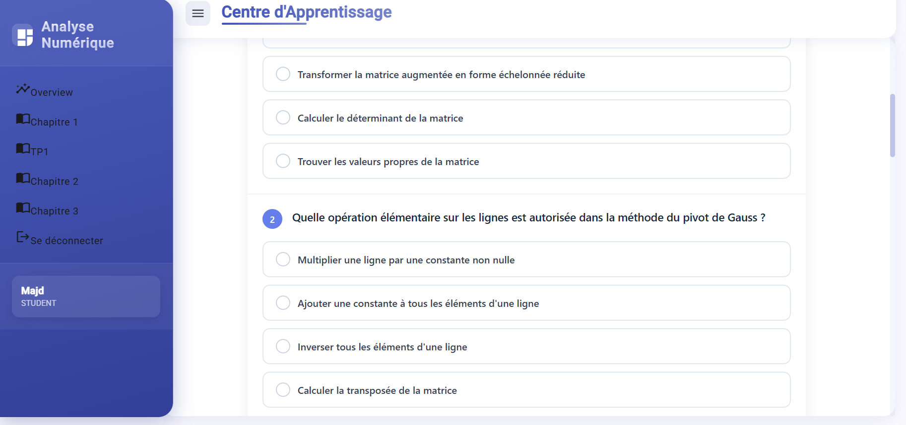  

---

### 🔢 Méthodes Numériques

- **Résolution par Gauss** :  
  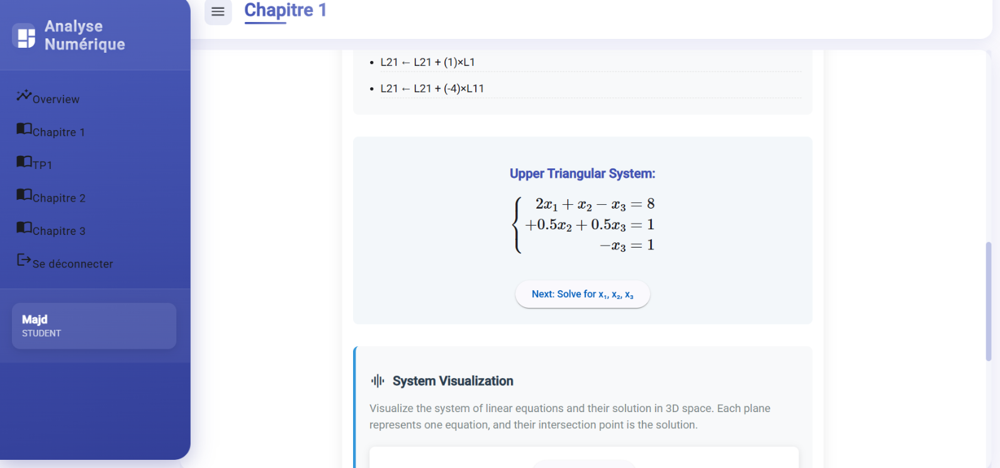  
  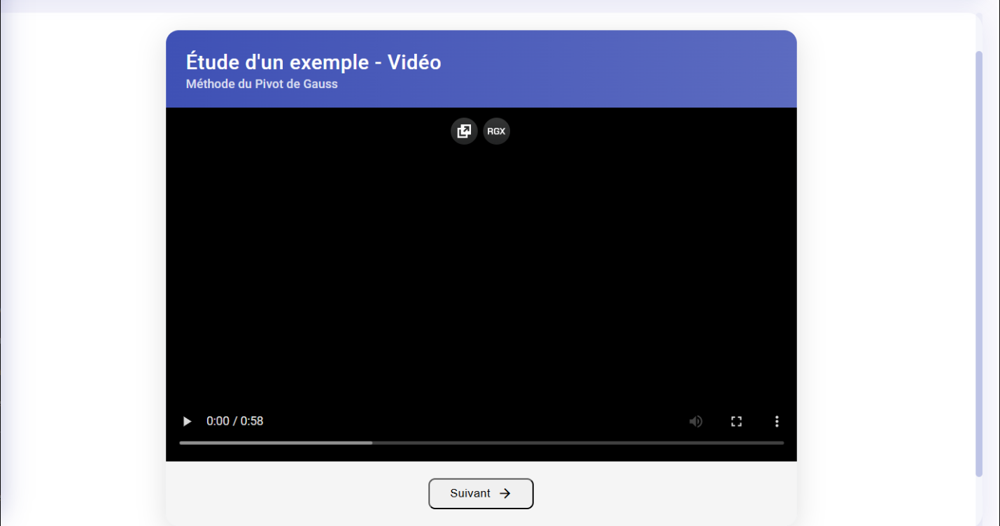  
  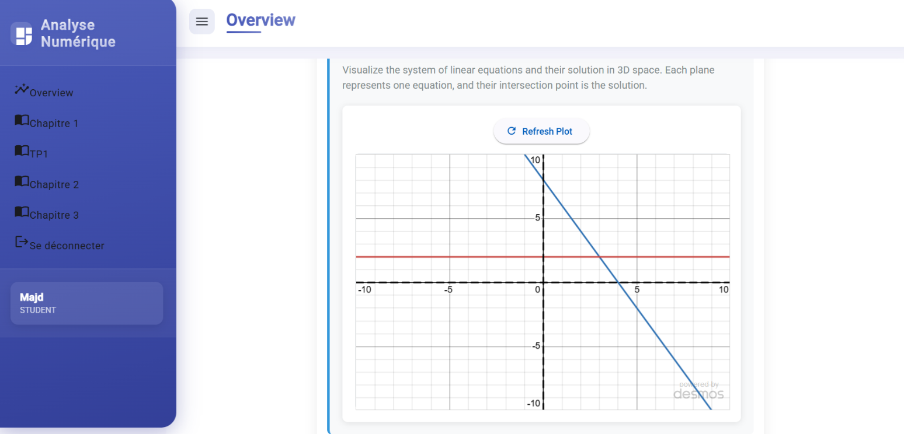  

- **Méthode de Jacobi** :  
  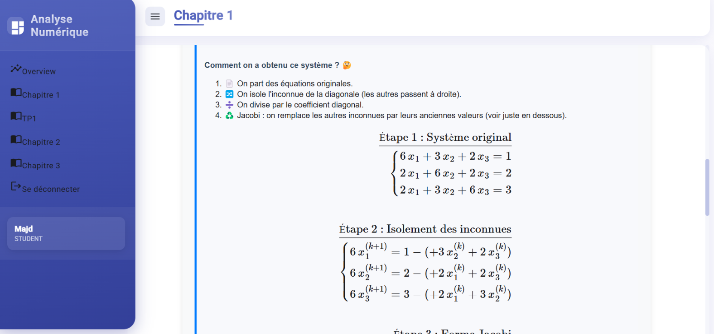  
  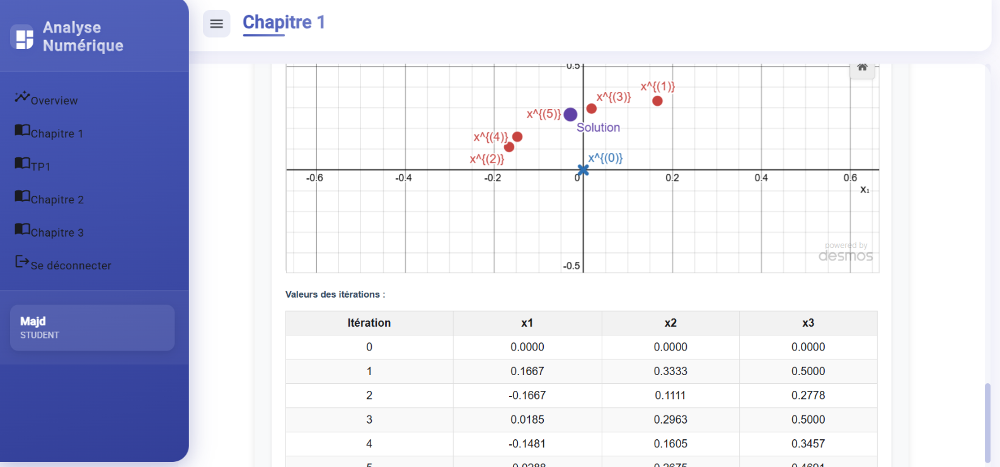  

---

### 🐍 Intégration Python
- Exemple d’utilisation Python dans le tableau de bord :  
  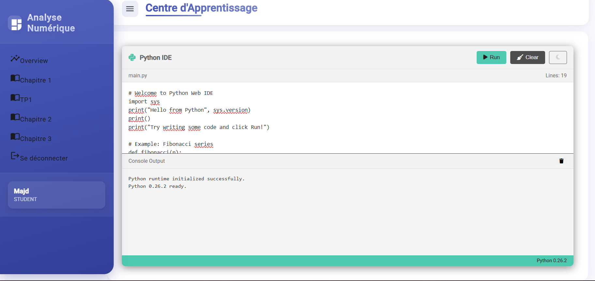  

---

## 🛠️ Technologies Utilisées

- **Frontend :** Angular 19, Bootstrap  
- **Backend :** Spring Boot (Java 21), API REST  
- **Éducation & Visualisation :** MathJax, Manim  
- **IA :** Génération automatique de quiz avec Gemini API  
- **Base de données :** MySQL, JPA/Hibernate  

---

## 🎓 Objectif Pédagogique

Ce projet vise à rendre l’enseignement de l’analyse numérique :  
- Plus **intuitif** grâce aux visualisations interactives  
- Plus **pratique** avec des quiz et puzzles intégrés  
- Plus **motivant** grâce à l’IA et aux retours personnalisés  

---

## 👨‍💻 Auteur

- **Haythem Hammami** – Étudiant en ingénierie informatique à ESPRIT  
- 🌐 [LinkedIn](https://www.linkedin.com/in/heytham-hammami-6a9733248/)  
- 📧 haithem.hammami@esprit.tn  
